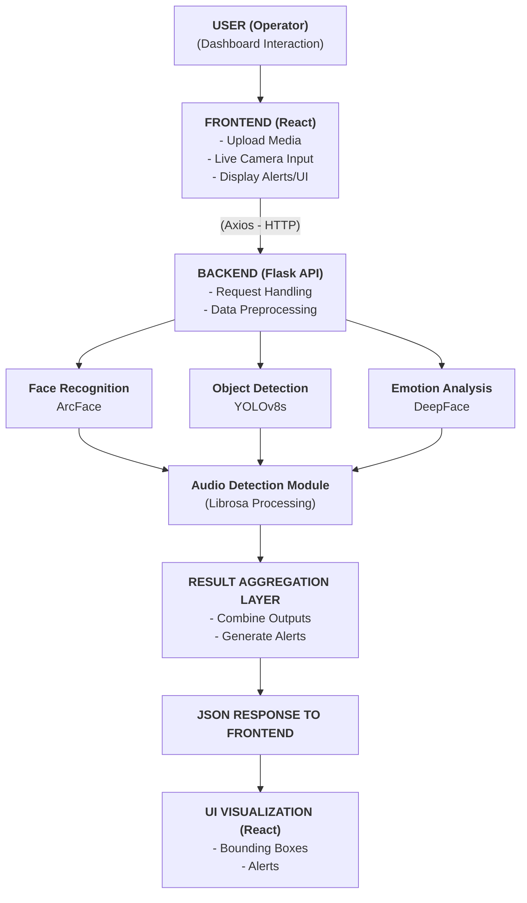

  <b>GUARDIAN AI: AN ADVANCED MULTI-MODAL ARTIFICIAL INTELLIGENCE SYSTEM FOR COMPREHENSIVE SECURITY AND SURVEILLANCE</b>

  A PROJECT REPORT

  Submitted by  
  <i>NAME OF THE CANDIDATE(S)</i>

  In partial fulfillment for the award of the degree  
  of  
  <i>BACHELOR OF ENGINEERING</i>

  IN  
  COMPUTER SCIENCE AND ENGINEERING

  <b>AGNI COLLEGE OF TECHNOLOGY</b> 
  (An Autonomous Institution) 
  (Affiliated to Anna University, Chennai)

  APR 2026

---

  <b>AGNI COLLEGE OF TECHNOLOGY</b> 
  (An Autonomous Institution, Affiliated to Anna University, Chennai)

  <b>BONAFIDE CERTIFICATE</b>

Certified that this project report “<b>GUARDIAN AI: AN ADVANCED MULTI-MODAL ARTIFICIAL INTELLIGENCE SYSTEM FOR COMPREHENSIVE SECURITY AND SURVEILLANCE</b>” Is the bonafide work of “<b>…………..NAME OF THE CANDIDATE(S)</b>” who carried out the project work under my supervision. Submitted for the Internship viva-voce examination held at Agni College of Technology on ……............

  

<<Signature of the Head of the Department>> &nbsp;&nbsp;&nbsp;&nbsp;&nbsp;&nbsp;&nbsp;&nbsp;&nbsp;&nbsp;&nbsp;&nbsp;&nbsp;&nbsp;&nbsp;&nbsp;&nbsp;&nbsp;&nbsp;&nbsp;&nbsp;&nbsp;&nbsp;&nbsp; <<Signature of the Supervisor>> 
<b>SIGNATURE</b> &nbsp;&nbsp;&nbsp;&nbsp;&nbsp;&nbsp;&nbsp;&nbsp;&nbsp;&nbsp;&nbsp;&nbsp;&nbsp;&nbsp;&nbsp;&nbsp;&nbsp;&nbsp;&nbsp;&nbsp;&nbsp;&nbsp;&nbsp;&nbsp;&nbsp;&nbsp;&nbsp;&nbsp;&nbsp;&nbsp;&nbsp;&nbsp;&nbsp;&nbsp;&nbsp;&nbsp;&nbsp;&nbsp;&nbsp;&nbsp;&nbsp;&nbsp;&nbsp;&nbsp;&nbsp;&nbsp;&nbsp;&nbsp;&nbsp;&nbsp;&nbsp;&nbsp;&nbsp;&nbsp;&nbsp;&nbsp;&nbsp;&nbsp;&nbsp;&nbsp;&nbsp;&nbsp;&nbsp;&nbsp;&nbsp;&nbsp;&nbsp;&nbsp;&nbsp; <b>SIGNATURE</b>

 

<<Name>> &nbsp;&nbsp;&nbsp;&nbsp;&nbsp;&nbsp;&nbsp;&nbsp;&nbsp;&nbsp;&nbsp;&nbsp;&nbsp;&nbsp;&nbsp;&nbsp;&nbsp;&nbsp;&nbsp;&nbsp;&nbsp;&nbsp;&nbsp;&nbsp;&nbsp;&nbsp;&nbsp;&nbsp;&nbsp;&nbsp;&nbsp;&nbsp;&nbsp;&nbsp;&nbsp;&nbsp;&nbsp;&nbsp;&nbsp;&nbsp;&nbsp;&nbsp;&nbsp;&nbsp;&nbsp;&nbsp;&nbsp;&nbsp;&nbsp;&nbsp;&nbsp;&nbsp;&nbsp;&nbsp;&nbsp;&nbsp;&nbsp;&nbsp;&nbsp;&nbsp;&nbsp;&nbsp;&nbsp;&nbsp;&nbsp;&nbsp;&nbsp;&nbsp;&nbsp;&nbsp;&nbsp;&nbsp;&nbsp;&nbsp;&nbsp;&nbsp; <<Name>> 
<b>HEAD OF THE DEPARTMENT</b> &nbsp;&nbsp;&nbsp;&nbsp;&nbsp;&nbsp;&nbsp;&nbsp;&nbsp;&nbsp;&nbsp;&nbsp;&nbsp;&nbsp;&nbsp;&nbsp;&nbsp;&nbsp;&nbsp;&nbsp;&nbsp;&nbsp;&nbsp;&nbsp;&nbsp;&nbsp;&nbsp;&nbsp;&nbsp;&nbsp;&nbsp;&nbsp;&nbsp;&nbsp;&nbsp;&nbsp;&nbsp;&nbsp;&nbsp;&nbsp;&nbsp; <b>SUPERVISOR</b>

 

<<Academic Designation>> 
<<Department>> &nbsp;&nbsp;&nbsp;&nbsp;&nbsp;&nbsp;&nbsp;&nbsp;&nbsp;&nbsp;&nbsp;&nbsp;&nbsp;&nbsp;&nbsp;&nbsp;&nbsp;&nbsp;&nbsp;&nbsp;&nbsp;&nbsp;&nbsp;&nbsp;&nbsp;&nbsp;&nbsp;&nbsp;&nbsp;&nbsp;&nbsp;&nbsp;&nbsp;&nbsp;&nbsp;&nbsp;&nbsp;&nbsp;&nbsp;&nbsp;&nbsp;&nbsp;&nbsp;&nbsp;&nbsp;&nbsp;&nbsp;&nbsp;&nbsp;&nbsp;&nbsp;&nbsp;&nbsp;&nbsp;&nbsp;&nbsp;&nbsp;&nbsp;&nbsp;&nbsp;&nbsp;&nbsp; <<Department>> 
<<Full address of the Dept & College>> &nbsp;&nbsp;&nbsp;&nbsp;&nbsp;&nbsp;&nbsp;&nbsp;&nbsp;&nbsp;&nbsp;&nbsp;&nbsp;&nbsp;&nbsp;&nbsp;&nbsp;&nbsp;&nbsp;&nbsp;&nbsp;&nbsp;&nbsp;&nbsp;&nbsp;&nbsp; <<Full address of the Dept & College>>

   

Signature of the Internal Examiner &nbsp;&nbsp;&nbsp;&nbsp;&nbsp;&nbsp;&nbsp;&nbsp;&nbsp;&nbsp;&nbsp;&nbsp;&nbsp;&nbsp;&nbsp;&nbsp;&nbsp;&nbsp;&nbsp;&nbsp;&nbsp;&nbsp;&nbsp;&nbsp;&nbsp;&nbsp;&nbsp;&nbsp;&nbsp;&nbsp;&nbsp;&nbsp;&nbsp;&nbsp;&nbsp;&nbsp;&nbsp;&nbsp; Signature of the External Examiner

---

## ABSTRACT

The rapid advancement of artificial intelligence has revolutionized traditional video monitoring, emphasizing the need for comprehensive and proactive security systems. This study proposes GuardianAI, an advanced, multi-modal artificial intelligence framework designed for robust security, surveillance, and situational awareness. The system transcends conventional surveillance by seamlessly integrating real-time AI analysis of faces, objects, emotions, and audio events. Built on a modern React-based dashboard and a Python Flask backend, the architecture intelligently ingests diverse media inputs—ranging from static files to live IP camera feeds—and processes them through specialized machine learning pipelines. High-accuracy models, including InsightFace (ArcFace) for facial recognition, YOLOv8s for proactive object detection, DeepFace for emotional and behavioral analysis, and custom audio heuristics via Librosa for panic detection, are employed to automatically identify and flag diverse threats. Experimental evaluations demonstrate significant improvements in threat detection latency and accuracy compared to single-modal systems, ensuring an intuitive, high-performance user experience. The proposed framework offers a practical and scalable solution for modern security operations, enabling intelligent, multi-layered threat prevention and proactive environment monitoring.

---

## ACKNOWLEDGEMENT

*(Students to provide their acknowledgements here, thanking the institution, guide, HOD, and other individuals who supported the project).*

---

## TABLE OF CONTENTS

**CHAPTER NO.** &nbsp;&nbsp;&nbsp;&nbsp;&nbsp;&nbsp;&nbsp;&nbsp;&nbsp;&nbsp;&nbsp;&nbsp;&nbsp;&nbsp; **TITLE** &nbsp;&nbsp;&nbsp;&nbsp;&nbsp;&nbsp;&nbsp;&nbsp;&nbsp;&nbsp;&nbsp;&nbsp;&nbsp;&nbsp;&nbsp;&nbsp;&nbsp;&nbsp;&nbsp;&nbsp;&nbsp;&nbsp;&nbsp;&nbsp;&nbsp;&nbsp;&nbsp;&nbsp;&nbsp;&nbsp;&nbsp;&nbsp;&nbsp;&nbsp;&nbsp;&nbsp;&nbsp;&nbsp;&nbsp;&nbsp;&nbsp;&nbsp;&nbsp;&nbsp; **PAGE NO.**

&nbsp;&nbsp;&nbsp;&nbsp;&nbsp;&nbsp;&nbsp;&nbsp;&nbsp;&nbsp;&nbsp;&nbsp;&nbsp;&nbsp;&nbsp;&nbsp;&nbsp;&nbsp;&nbsp;&nbsp;&nbsp;&nbsp;&nbsp;&nbsp;&nbsp;&nbsp;&nbsp;&nbsp;&nbsp;&nbsp;&nbsp;&nbsp;&nbsp;&nbsp;&nbsp;&nbsp;&nbsp;&nbsp;&nbsp;&nbsp;&nbsp; ABSTRACT &nbsp;&nbsp;&nbsp;&nbsp;&nbsp;&nbsp;&nbsp;&nbsp;&nbsp;&nbsp;&nbsp;&nbsp;&nbsp;&nbsp;&nbsp;&nbsp;&nbsp;&nbsp;&nbsp;&nbsp;&nbsp;&nbsp;&nbsp;&nbsp;&nbsp;&nbsp;&nbsp;&nbsp;&nbsp;&nbsp;&nbsp;&nbsp;&nbsp;&nbsp;&nbsp;&nbsp;&nbsp;&nbsp;&nbsp;&nbsp;&nbsp;&nbsp; i  
&nbsp;&nbsp;&nbsp;&nbsp;&nbsp;&nbsp;&nbsp;&nbsp;&nbsp;&nbsp;&nbsp;&nbsp;&nbsp;&nbsp;&nbsp;&nbsp;&nbsp;&nbsp;&nbsp;&nbsp;&nbsp;&nbsp;&nbsp;&nbsp;&nbsp;&nbsp;&nbsp;&nbsp;&nbsp;&nbsp;&nbsp;&nbsp;&nbsp;&nbsp;&nbsp;&nbsp;&nbsp;&nbsp;&nbsp;&nbsp;&nbsp; ACKNOWLEDGEMENT &nbsp;&nbsp;&nbsp;&nbsp;&nbsp;&nbsp;&nbsp;&nbsp;&nbsp;&nbsp;&nbsp;&nbsp;&nbsp;&nbsp;&nbsp;&nbsp;&nbsp;&nbsp;&nbsp;&nbsp; ii  
&nbsp;&nbsp;&nbsp;&nbsp;&nbsp;&nbsp;&nbsp;&nbsp;&nbsp;&nbsp;&nbsp;&nbsp;&nbsp;&nbsp;&nbsp;&nbsp;&nbsp;&nbsp;&nbsp;&nbsp;&nbsp;&nbsp;&nbsp;&nbsp;&nbsp;&nbsp;&nbsp;&nbsp;&nbsp;&nbsp;&nbsp;&nbsp;&nbsp;&nbsp;&nbsp;&nbsp;&nbsp;&nbsp;&nbsp;&nbsp;&nbsp; LIST OF TABLES &nbsp;&nbsp;&nbsp;&nbsp;&nbsp;&nbsp;&nbsp;&nbsp;&nbsp;&nbsp;&nbsp;&nbsp;&nbsp;&nbsp;&nbsp;&nbsp;&nbsp;&nbsp;&nbsp;&nbsp;&nbsp;&nbsp;&nbsp;&nbsp;&nbsp;&nbsp;&nbsp;&nbsp;&nbsp;&nbsp;&nbsp;&nbsp; iii  
&nbsp;&nbsp;&nbsp;&nbsp;&nbsp;&nbsp;&nbsp;&nbsp;&nbsp;&nbsp;&nbsp;&nbsp;&nbsp;&nbsp;&nbsp;&nbsp;&nbsp;&nbsp;&nbsp;&nbsp;&nbsp;&nbsp;&nbsp;&nbsp;&nbsp;&nbsp;&nbsp;&nbsp;&nbsp;&nbsp;&nbsp;&nbsp;&nbsp;&nbsp;&nbsp;&nbsp;&nbsp;&nbsp;&nbsp;&nbsp;&nbsp; LIST OF FIGURES &nbsp;&nbsp;&nbsp;&nbsp;&nbsp;&nbsp;&nbsp;&nbsp;&nbsp;&nbsp;&nbsp;&nbsp;&nbsp;&nbsp;&nbsp;&nbsp;&nbsp;&nbsp;&nbsp;&nbsp;&nbsp;&nbsp;&nbsp;&nbsp;&nbsp;&nbsp;&nbsp;&nbsp;&nbsp;&nbsp; iv  
&nbsp;&nbsp;&nbsp;&nbsp;&nbsp;&nbsp;&nbsp;&nbsp;&nbsp;&nbsp;&nbsp;&nbsp;&nbsp;&nbsp;&nbsp;&nbsp;&nbsp;&nbsp;&nbsp;&nbsp;&nbsp;&nbsp;&nbsp;&nbsp;&nbsp;&nbsp;&nbsp;&nbsp;&nbsp;&nbsp;&nbsp;&nbsp;&nbsp;&nbsp;&nbsp;&nbsp;&nbsp;&nbsp;&nbsp;&nbsp;&nbsp; LIST OF SYMBOLS &nbsp;&nbsp;&nbsp;&nbsp;&nbsp;&nbsp;&nbsp;&nbsp;&nbsp;&nbsp;&nbsp;&nbsp;&nbsp;&nbsp;&nbsp;&nbsp;&nbsp;&nbsp;&nbsp;&nbsp;&nbsp;&nbsp;&nbsp;&nbsp;&nbsp;&nbsp;&nbsp;&nbsp; v

**1.** &nbsp;&nbsp;&nbsp;&nbsp;&nbsp;&nbsp;&nbsp;&nbsp;&nbsp;&nbsp;&nbsp;&nbsp;&nbsp;&nbsp;&nbsp;&nbsp;&nbsp;&nbsp;&nbsp;&nbsp;&nbsp;&nbsp;&nbsp;&nbsp;&nbsp;&nbsp;&nbsp;&nbsp;&nbsp;&nbsp;&nbsp;&nbsp;&nbsp;&nbsp;&nbsp;&nbsp; **INTRODUCTION**
&nbsp;&nbsp;&nbsp;&nbsp;&nbsp;&nbsp; 1.1 &nbsp;&nbsp;&nbsp;&nbsp;&nbsp;&nbsp;&nbsp;&nbsp;&nbsp;&nbsp;&nbsp;&nbsp;&nbsp;&nbsp;&nbsp;&nbsp;&nbsp;&nbsp;&nbsp;&nbsp;&nbsp;&nbsp;&nbsp;&nbsp;&nbsp;&nbsp;&nbsp;&nbsp; GENERAL (BACKGROUND)
&nbsp;&nbsp;&nbsp;&nbsp;&nbsp;&nbsp; 1.2 &nbsp;&nbsp;&nbsp;&nbsp;&nbsp;&nbsp;&nbsp;&nbsp;&nbsp;&nbsp;&nbsp;&nbsp;&nbsp;&nbsp;&nbsp;&nbsp;&nbsp;&nbsp;&nbsp;&nbsp;&nbsp;&nbsp;&nbsp;&nbsp;&nbsp;&nbsp;&nbsp;&nbsp; THE SECURITY IMPERATIVE
&nbsp;&nbsp;&nbsp;&nbsp;&nbsp;&nbsp; 1.3 &nbsp;&nbsp;&nbsp;&nbsp;&nbsp;&nbsp;&nbsp;&nbsp;&nbsp;&nbsp;&nbsp;&nbsp;&nbsp;&nbsp;&nbsp;&nbsp;&nbsp;&nbsp;&nbsp;&nbsp;&nbsp;&nbsp;&nbsp;&nbsp;&nbsp;&nbsp;&nbsp;&nbsp; THE RESEARCH PROBLEM
&nbsp;&nbsp;&nbsp;&nbsp;&nbsp;&nbsp; 1.4 &nbsp;&nbsp;&nbsp;&nbsp;&nbsp;&nbsp;&nbsp;&nbsp;&nbsp;&nbsp;&nbsp;&nbsp;&nbsp;&nbsp;&nbsp;&nbsp;&nbsp;&nbsp;&nbsp;&nbsp;&nbsp;&nbsp;&nbsp;&nbsp;&nbsp;&nbsp;&nbsp;&nbsp; PROPOSED SOLUTION
&nbsp;&nbsp;&nbsp;&nbsp;&nbsp;&nbsp; 1.5 &nbsp;&nbsp;&nbsp;&nbsp;&nbsp;&nbsp;&nbsp;&nbsp;&nbsp;&nbsp;&nbsp;&nbsp;&nbsp;&nbsp;&nbsp;&nbsp;&nbsp;&nbsp;&nbsp;&nbsp;&nbsp;&nbsp;&nbsp;&nbsp;&nbsp;&nbsp;&nbsp;&nbsp; RESEARCH AIM AND OBJECTIVES
&nbsp;&nbsp;&nbsp;&nbsp;&nbsp;&nbsp; 1.6 &nbsp;&nbsp;&nbsp;&nbsp;&nbsp;&nbsp;&nbsp;&nbsp;&nbsp;&nbsp;&nbsp;&nbsp;&nbsp;&nbsp;&nbsp;&nbsp;&nbsp;&nbsp;&nbsp;&nbsp;&nbsp;&nbsp;&nbsp;&nbsp;&nbsp;&nbsp;&nbsp;&nbsp; SCOPE AND LIMITATIONS
&nbsp;&nbsp;&nbsp;&nbsp;&nbsp;&nbsp; 1.7 &nbsp;&nbsp;&nbsp;&nbsp;&nbsp;&nbsp;&nbsp;&nbsp;&nbsp;&nbsp;&nbsp;&nbsp;&nbsp;&nbsp;&nbsp;&nbsp;&nbsp;&nbsp;&nbsp;&nbsp;&nbsp;&nbsp;&nbsp;&nbsp;&nbsp;&nbsp;&nbsp;&nbsp; CONTRIBUTION TO KNOWLEDGE
&nbsp;&nbsp;&nbsp;&nbsp;&nbsp;&nbsp; 1.8 &nbsp;&nbsp;&nbsp;&nbsp;&nbsp;&nbsp;&nbsp;&nbsp;&nbsp;&nbsp;&nbsp;&nbsp;&nbsp;&nbsp;&nbsp;&nbsp;&nbsp;&nbsp;&nbsp;&nbsp;&nbsp;&nbsp;&nbsp;&nbsp;&nbsp;&nbsp;&nbsp;&nbsp; THESIS ORGANIZATION

**2.** &nbsp;&nbsp;&nbsp;&nbsp;&nbsp;&nbsp;&nbsp;&nbsp;&nbsp;&nbsp;&nbsp;&nbsp;&nbsp;&nbsp;&nbsp;&nbsp;&nbsp;&nbsp;&nbsp;&nbsp;&nbsp;&nbsp;&nbsp;&nbsp;&nbsp;&nbsp;&nbsp;&nbsp;&nbsp;&nbsp;&nbsp;&nbsp;&nbsp;&nbsp;&nbsp;&nbsp; **LITERATURE REVIEW**
&nbsp;&nbsp;&nbsp;&nbsp;&nbsp;&nbsp; 2.1 &nbsp;&nbsp;&nbsp;&nbsp;&nbsp;&nbsp;&nbsp;&nbsp;&nbsp;&nbsp;&nbsp;&nbsp;&nbsp;&nbsp;&nbsp;&nbsp;&nbsp;&nbsp;&nbsp;&nbsp;&nbsp;&nbsp;&nbsp;&nbsp;&nbsp;&nbsp;&nbsp;&nbsp; INTRODUCTION
&nbsp;&nbsp;&nbsp;&nbsp;&nbsp;&nbsp; 2.2 &nbsp;&nbsp;&nbsp;&nbsp;&nbsp;&nbsp;&nbsp;&nbsp;&nbsp;&nbsp;&nbsp;&nbsp;&nbsp;&nbsp;&nbsp;&nbsp;&nbsp;&nbsp;&nbsp;&nbsp;&nbsp;&nbsp;&nbsp;&nbsp;&nbsp;&nbsp;&nbsp;&nbsp; FUNDAMENTALS OF AI-BASED SURVEILLANCE
&nbsp;&nbsp;&nbsp;&nbsp;&nbsp;&nbsp; 2.3 &nbsp;&nbsp;&nbsp;&nbsp;&nbsp;&nbsp;&nbsp;&nbsp;&nbsp;&nbsp;&nbsp;&nbsp;&nbsp;&nbsp;&nbsp;&nbsp;&nbsp;&nbsp;&nbsp;&nbsp;&nbsp;&nbsp;&nbsp;&nbsp;&nbsp;&nbsp;&nbsp;&nbsp; EVOLUTION OF FACIAL RECOGNITION AND OBJECT DETECTION
&nbsp;&nbsp;&nbsp;&nbsp;&nbsp;&nbsp; 2.4 &nbsp;&nbsp;&nbsp;&nbsp;&nbsp;&nbsp;&nbsp;&nbsp;&nbsp;&nbsp;&nbsp;&nbsp;&nbsp;&nbsp;&nbsp;&nbsp;&nbsp;&nbsp;&nbsp;&nbsp;&nbsp;&nbsp;&nbsp;&nbsp;&nbsp;&nbsp;&nbsp;&nbsp; EMERGENCE OF EMOTION AND AUDIO ANALYSIS
&nbsp;&nbsp;&nbsp;&nbsp;&nbsp;&nbsp; 2.5 &nbsp;&nbsp;&nbsp;&nbsp;&nbsp;&nbsp;&nbsp;&nbsp;&nbsp;&nbsp;&nbsp;&nbsp;&nbsp;&nbsp;&nbsp;&nbsp;&nbsp;&nbsp;&nbsp;&nbsp;&nbsp;&nbsp;&nbsp;&nbsp;&nbsp;&nbsp;&nbsp;&nbsp; SYNTHESIS AND IDENTIFICATION OF THE RESEARCH GAP
&nbsp;&nbsp;&nbsp;&nbsp;&nbsp;&nbsp; 2.6 &nbsp;&nbsp;&nbsp;&nbsp;&nbsp;&nbsp;&nbsp;&nbsp;&nbsp;&nbsp;&nbsp;&nbsp;&nbsp;&nbsp;&nbsp;&nbsp;&nbsp;&nbsp;&nbsp;&nbsp;&nbsp;&nbsp;&nbsp;&nbsp;&nbsp;&nbsp;&nbsp;&nbsp; SUMMARY

**3.** &nbsp;&nbsp;&nbsp;&nbsp;&nbsp;&nbsp;&nbsp;&nbsp;&nbsp;&nbsp;&nbsp;&nbsp;&nbsp;&nbsp;&nbsp;&nbsp;&nbsp;&nbsp;&nbsp;&nbsp;&nbsp;&nbsp;&nbsp;&nbsp;&nbsp;&nbsp;&nbsp;&nbsp;&nbsp;&nbsp;&nbsp;&nbsp;&nbsp;&nbsp;&nbsp;&nbsp; **METHODOLOGY AND SYSTEM ARCHITECTURE**
&nbsp;&nbsp;&nbsp;&nbsp;&nbsp;&nbsp; 3.1 &nbsp;&nbsp;&nbsp;&nbsp;&nbsp;&nbsp;&nbsp;&nbsp;&nbsp;&nbsp;&nbsp;&nbsp;&nbsp;&nbsp;&nbsp;&nbsp;&nbsp;&nbsp;&nbsp;&nbsp;&nbsp;&nbsp;&nbsp;&nbsp;&nbsp;&nbsp;&nbsp;&nbsp; INTRODUCTION
&nbsp;&nbsp;&nbsp;&nbsp;&nbsp;&nbsp; 3.2 &nbsp;&nbsp;&nbsp;&nbsp;&nbsp;&nbsp;&nbsp;&nbsp;&nbsp;&nbsp;&nbsp;&nbsp;&nbsp;&nbsp;&nbsp;&nbsp;&nbsp;&nbsp;&nbsp;&nbsp;&nbsp;&nbsp;&nbsp;&nbsp;&nbsp;&nbsp;&nbsp;&nbsp; SYSTEM ARCHITECTURE
&nbsp;&nbsp;&nbsp;&nbsp;&nbsp;&nbsp; 3.3 &nbsp;&nbsp;&nbsp;&nbsp;&nbsp;&nbsp;&nbsp;&nbsp;&nbsp;&nbsp;&nbsp;&nbsp;&nbsp;&nbsp;&nbsp;&nbsp;&nbsp;&nbsp;&nbsp;&nbsp;&nbsp;&nbsp;&nbsp;&nbsp;&nbsp;&nbsp;&nbsp;&nbsp; CORE MODULES AND WORKING MODELS
&nbsp;&nbsp;&nbsp;&nbsp;&nbsp;&nbsp;&nbsp;&nbsp;&nbsp;&nbsp;&nbsp;&nbsp; 3.3.1 &nbsp;&nbsp;&nbsp;&nbsp;&nbsp;&nbsp;&nbsp;&nbsp;&nbsp;&nbsp;&nbsp;&nbsp;&nbsp;&nbsp;&nbsp;&nbsp;&nbsp;&nbsp;&nbsp;&nbsp;&nbsp;&nbsp; Intelligent Face Recognition Module
&nbsp;&nbsp;&nbsp;&nbsp;&nbsp;&nbsp;&nbsp;&nbsp;&nbsp;&nbsp;&nbsp;&nbsp; 3.3.2 &nbsp;&nbsp;&nbsp;&nbsp;&nbsp;&nbsp;&nbsp;&nbsp;&nbsp;&nbsp;&nbsp;&nbsp;&nbsp;&nbsp;&nbsp;&nbsp;&nbsp;&nbsp;&nbsp;&nbsp;&nbsp;&nbsp; Proactive Object Detection Module
&nbsp;&nbsp;&nbsp;&nbsp;&nbsp;&nbsp;&nbsp;&nbsp;&nbsp;&nbsp;&nbsp;&nbsp; 3.3.3 &nbsp;&nbsp;&nbsp;&nbsp;&nbsp;&nbsp;&nbsp;&nbsp;&nbsp;&nbsp;&nbsp;&nbsp;&nbsp;&nbsp;&nbsp;&nbsp;&nbsp;&nbsp;&nbsp;&nbsp;&nbsp;&nbsp; Emotion & Behavioral Analysis Module
&nbsp;&nbsp;&nbsp;&nbsp;&nbsp;&nbsp;&nbsp;&nbsp;&nbsp;&nbsp;&nbsp;&nbsp; 3.3.4 &nbsp;&nbsp;&nbsp;&nbsp;&nbsp;&nbsp;&nbsp;&nbsp;&nbsp;&nbsp;&nbsp;&nbsp;&nbsp;&nbsp;&nbsp;&nbsp;&nbsp;&nbsp;&nbsp;&nbsp;&nbsp;&nbsp; Audio Panic & Threat Detection Module
&nbsp;&nbsp;&nbsp;&nbsp;&nbsp;&nbsp; 3.4 &nbsp;&nbsp;&nbsp;&nbsp;&nbsp;&nbsp;&nbsp;&nbsp;&nbsp;&nbsp;&nbsp;&nbsp;&nbsp;&nbsp;&nbsp;&nbsp;&nbsp;&nbsp;&nbsp;&nbsp;&nbsp;&nbsp;&nbsp;&nbsp;&nbsp;&nbsp;&nbsp;&nbsp; ARCHITECTURAL DATA FLOW
&nbsp;&nbsp;&nbsp;&nbsp;&nbsp;&nbsp; 3.5 &nbsp;&nbsp;&nbsp;&nbsp;&nbsp;&nbsp;&nbsp;&nbsp;&nbsp;&nbsp;&nbsp;&nbsp;&nbsp;&nbsp;&nbsp;&nbsp;&nbsp;&nbsp;&nbsp;&nbsp;&nbsp;&nbsp;&nbsp;&nbsp;&nbsp;&nbsp;&nbsp;&nbsp; SIMULATION AND DEVELOPMENT ENVIRONMENT
&nbsp;&nbsp;&nbsp;&nbsp;&nbsp;&nbsp; 3.6 &nbsp;&nbsp;&nbsp;&nbsp;&nbsp;&nbsp;&nbsp;&nbsp;&nbsp;&nbsp;&nbsp;&nbsp;&nbsp;&nbsp;&nbsp;&nbsp;&nbsp;&nbsp;&nbsp;&nbsp;&nbsp;&nbsp;&nbsp;&nbsp;&nbsp;&nbsp;&nbsp;&nbsp; SUMMARY

**4.** &nbsp;&nbsp;&nbsp;&nbsp;&nbsp;&nbsp;&nbsp;&nbsp;&nbsp;&nbsp;&nbsp;&nbsp;&nbsp;&nbsp;&nbsp;&nbsp;&nbsp;&nbsp;&nbsp;&nbsp;&nbsp;&nbsp;&nbsp;&nbsp;&nbsp;&nbsp;&nbsp;&nbsp;&nbsp;&nbsp;&nbsp;&nbsp;&nbsp;&nbsp;&nbsp;&nbsp; **IMPLEMENTATION AND DEPLOYMENT SETUP**
&nbsp;&nbsp;&nbsp;&nbsp;&nbsp;&nbsp; 4.1 &nbsp;&nbsp;&nbsp;&nbsp;&nbsp;&nbsp;&nbsp;&nbsp;&nbsp;&nbsp;&nbsp;&nbsp;&nbsp;&nbsp;&nbsp;&nbsp;&nbsp;&nbsp;&nbsp;&nbsp;&nbsp;&nbsp;&nbsp;&nbsp;&nbsp;&nbsp;&nbsp;&nbsp; INTRODUCTION
&nbsp;&nbsp;&nbsp;&nbsp;&nbsp;&nbsp; 4.2 &nbsp;&nbsp;&nbsp;&nbsp;&nbsp;&nbsp;&nbsp;&nbsp;&nbsp;&nbsp;&nbsp;&nbsp;&nbsp;&nbsp;&nbsp;&nbsp;&nbsp;&nbsp;&nbsp;&nbsp;&nbsp;&nbsp;&nbsp;&nbsp;&nbsp;&nbsp;&nbsp;&nbsp; FRONTEND AND BACKEND CONFIGURATION
&nbsp;&nbsp;&nbsp;&nbsp;&nbsp;&nbsp; 4.3 &nbsp;&nbsp;&nbsp;&nbsp;&nbsp;&nbsp;&nbsp;&nbsp;&nbsp;&nbsp;&nbsp;&nbsp;&nbsp;&nbsp;&nbsp;&nbsp;&nbsp;&nbsp;&nbsp;&nbsp;&nbsp;&nbsp;&nbsp;&nbsp;&nbsp;&nbsp;&nbsp;&nbsp; PIPELINE EXECUTION AND FLOW
&nbsp;&nbsp;&nbsp;&nbsp;&nbsp;&nbsp; 4.4 &nbsp;&nbsp;&nbsp;&nbsp;&nbsp;&nbsp;&nbsp;&nbsp;&nbsp;&nbsp;&nbsp;&nbsp;&nbsp;&nbsp;&nbsp;&nbsp;&nbsp;&nbsp;&nbsp;&nbsp;&nbsp;&nbsp;&nbsp;&nbsp;&nbsp;&nbsp;&nbsp;&nbsp; SUMMARY OF IMPLEMENTATION

**5.** &nbsp;&nbsp;&nbsp;&nbsp;&nbsp;&nbsp;&nbsp;&nbsp;&nbsp;&nbsp;&nbsp;&nbsp;&nbsp;&nbsp;&nbsp;&nbsp;&nbsp;&nbsp;&nbsp;&nbsp;&nbsp;&nbsp;&nbsp;&nbsp;&nbsp;&nbsp;&nbsp;&nbsp;&nbsp;&nbsp;&nbsp;&nbsp;&nbsp;&nbsp;&nbsp;&nbsp; **DISCUSSION AND ANALYSIS**
&nbsp;&nbsp;&nbsp;&nbsp;&nbsp;&nbsp; 5.1 &nbsp;&nbsp;&nbsp;&nbsp;&nbsp;&nbsp;&nbsp;&nbsp;&nbsp;&nbsp;&nbsp;&nbsp;&nbsp;&nbsp;&nbsp;&nbsp;&nbsp;&nbsp;&nbsp;&nbsp;&nbsp;&nbsp;&nbsp;&nbsp;&nbsp;&nbsp;&nbsp;&nbsp; INTRODUCTION
&nbsp;&nbsp;&nbsp;&nbsp;&nbsp;&nbsp; 5.2 &nbsp;&nbsp;&nbsp;&nbsp;&nbsp;&nbsp;&nbsp;&nbsp;&nbsp;&nbsp;&nbsp;&nbsp;&nbsp;&nbsp;&nbsp;&nbsp;&nbsp;&nbsp;&nbsp;&nbsp;&nbsp;&nbsp;&nbsp;&nbsp;&nbsp;&nbsp;&nbsp;&nbsp; INTERPRETATION OF MULTI-MODAL EFFICACY
&nbsp;&nbsp;&nbsp;&nbsp;&nbsp;&nbsp; 5.3 &nbsp;&nbsp;&nbsp;&nbsp;&nbsp;&nbsp;&nbsp;&nbsp;&nbsp;&nbsp;&nbsp;&nbsp;&nbsp;&nbsp;&nbsp;&nbsp;&nbsp;&nbsp;&nbsp;&nbsp;&nbsp;&nbsp;&nbsp;&nbsp;&nbsp;&nbsp;&nbsp;&nbsp; PERFORMANCE TRADE-OFF: ACCURACY VS. REAL-TIME LATENCY
&nbsp;&nbsp;&nbsp;&nbsp;&nbsp;&nbsp; 5.4 &nbsp;&nbsp;&nbsp;&nbsp;&nbsp;&nbsp;&nbsp;&nbsp;&nbsp;&nbsp;&nbsp;&nbsp;&nbsp;&nbsp;&nbsp;&nbsp;&nbsp;&nbsp;&nbsp;&nbsp;&nbsp;&nbsp;&nbsp;&nbsp;&nbsp;&nbsp;&nbsp;&nbsp; IMPLICATIONS FOR SECURITY PROVIDERS
&nbsp;&nbsp;&nbsp;&nbsp;&nbsp;&nbsp; 5.5 &nbsp;&nbsp;&nbsp;&nbsp;&nbsp;&nbsp;&nbsp;&nbsp;&nbsp;&nbsp;&nbsp;&nbsp;&nbsp;&nbsp;&nbsp;&nbsp;&nbsp;&nbsp;&nbsp;&nbsp;&nbsp;&nbsp;&nbsp;&nbsp;&nbsp;&nbsp;&nbsp;&nbsp; LIMITATIONS OF THE STUDY
&nbsp;&nbsp;&nbsp;&nbsp;&nbsp;&nbsp; 5.6 &nbsp;&nbsp;&nbsp;&nbsp;&nbsp;&nbsp;&nbsp;&nbsp;&nbsp;&nbsp;&nbsp;&nbsp;&nbsp;&nbsp;&nbsp;&nbsp;&nbsp;&nbsp;&nbsp;&nbsp;&nbsp;&nbsp;&nbsp;&nbsp;&nbsp;&nbsp;&nbsp;&nbsp; SUMMARY

**6.** &nbsp;&nbsp;&nbsp;&nbsp;&nbsp;&nbsp;&nbsp;&nbsp;&nbsp;&nbsp;&nbsp;&nbsp;&nbsp;&nbsp;&nbsp;&nbsp;&nbsp;&nbsp;&nbsp;&nbsp;&nbsp;&nbsp;&nbsp;&nbsp;&nbsp;&nbsp;&nbsp;&nbsp;&nbsp;&nbsp;&nbsp;&nbsp;&nbsp;&nbsp;&nbsp;&nbsp; **CONCLUSION AND FUTURE WORK**
&nbsp;&nbsp;&nbsp;&nbsp;&nbsp;&nbsp; 6.1 &nbsp;&nbsp;&nbsp;&nbsp;&nbsp;&nbsp;&nbsp;&nbsp;&nbsp;&nbsp;&nbsp;&nbsp;&nbsp;&nbsp;&nbsp;&nbsp;&nbsp;&nbsp;&nbsp;&nbsp;&nbsp;&nbsp;&nbsp;&nbsp;&nbsp;&nbsp;&nbsp;&nbsp; INTRODUCTION
&nbsp;&nbsp;&nbsp;&nbsp;&nbsp;&nbsp; 6.2 &nbsp;&nbsp;&nbsp;&nbsp;&nbsp;&nbsp;&nbsp;&nbsp;&nbsp;&nbsp;&nbsp;&nbsp;&nbsp;&nbsp;&nbsp;&nbsp;&nbsp;&nbsp;&nbsp;&nbsp;&nbsp;&nbsp;&nbsp;&nbsp;&nbsp;&nbsp;&nbsp;&nbsp; SUMMARY AND RESEARCH SYNTHESIS
&nbsp;&nbsp;&nbsp;&nbsp;&nbsp;&nbsp; 6.3 &nbsp;&nbsp;&nbsp;&nbsp;&nbsp;&nbsp;&nbsp;&nbsp;&nbsp;&nbsp;&nbsp;&nbsp;&nbsp;&nbsp;&nbsp;&nbsp;&nbsp;&nbsp;&nbsp;&nbsp;&nbsp;&nbsp;&nbsp;&nbsp;&nbsp;&nbsp;&nbsp;&nbsp; REVISITING THE RESEARCH CONTRIBUTIONS
&nbsp;&nbsp;&nbsp;&nbsp;&nbsp;&nbsp; 6.4 &nbsp;&nbsp;&nbsp;&nbsp;&nbsp;&nbsp;&nbsp;&nbsp;&nbsp;&nbsp;&nbsp;&nbsp;&nbsp;&nbsp;&nbsp;&nbsp;&nbsp;&nbsp;&nbsp;&nbsp;&nbsp;&nbsp;&nbsp;&nbsp;&nbsp;&nbsp;&nbsp;&nbsp; DIRECTIONS FOR FUTURE RESEARCH
&nbsp;&nbsp;&nbsp;&nbsp;&nbsp;&nbsp; 6.5 &nbsp;&nbsp;&nbsp;&nbsp;&nbsp;&nbsp;&nbsp;&nbsp;&nbsp;&nbsp;&nbsp;&nbsp;&nbsp;&nbsp;&nbsp;&nbsp;&nbsp;&nbsp;&nbsp;&nbsp;&nbsp;&nbsp;&nbsp;&nbsp;&nbsp;&nbsp;&nbsp;&nbsp; CONCLUDING REMARKS

&nbsp;&nbsp;&nbsp;&nbsp;&nbsp;&nbsp;&nbsp;&nbsp;&nbsp;&nbsp;&nbsp;&nbsp;&nbsp;&nbsp;&nbsp;&nbsp;&nbsp;&nbsp;&nbsp;&nbsp;&nbsp;&nbsp;&nbsp;&nbsp;&nbsp;&nbsp;&nbsp;&nbsp;&nbsp;&nbsp;&nbsp;&nbsp;&nbsp;&nbsp;&nbsp;&nbsp;&nbsp;&nbsp;&nbsp;&nbsp;&nbsp; **APPENDICES**
&nbsp;&nbsp;&nbsp;&nbsp;&nbsp;&nbsp;&nbsp;&nbsp;&nbsp;&nbsp;&nbsp;&nbsp;&nbsp;&nbsp;&nbsp;&nbsp;&nbsp;&nbsp;&nbsp;&nbsp;&nbsp;&nbsp;&nbsp;&nbsp;&nbsp;&nbsp;&nbsp;&nbsp;&nbsp;&nbsp;&nbsp;&nbsp;&nbsp;&nbsp;&nbsp;&nbsp;&nbsp;&nbsp;&nbsp;&nbsp;&nbsp; APPENDIX 1: Sample Output Screenshots
&nbsp;&nbsp;&nbsp;&nbsp;&nbsp;&nbsp;&nbsp;&nbsp;&nbsp;&nbsp;&nbsp;&nbsp;&nbsp;&nbsp;&nbsp;&nbsp;&nbsp;&nbsp;&nbsp;&nbsp;&nbsp;&nbsp;&nbsp;&nbsp;&nbsp;&nbsp;&nbsp;&nbsp;&nbsp;&nbsp;&nbsp;&nbsp;&nbsp;&nbsp;&nbsp;&nbsp;&nbsp;&nbsp;&nbsp;&nbsp;&nbsp; APPENDIX 2: Core Algorithm Snippets

&nbsp;&nbsp;&nbsp;&nbsp;&nbsp;&nbsp;&nbsp;&nbsp;&nbsp;&nbsp;&nbsp;&nbsp;&nbsp;&nbsp;&nbsp;&nbsp;&nbsp;&nbsp;&nbsp;&nbsp;&nbsp;&nbsp;&nbsp;&nbsp;&nbsp;&nbsp;&nbsp;&nbsp;&nbsp;&nbsp;&nbsp;&nbsp;&nbsp;&nbsp;&nbsp;&nbsp;&nbsp;&nbsp;&nbsp;&nbsp;&nbsp; **REFERENCES**

---

## LIST OF TABLES
**(To be added during final compilation based on experiment outcomes in Chapter 4/5)**

---

## LIST OF FIGURES
**(To be added during final compilation illustrating architectural diagrams and dashboard screenshots)**

---

## LIST OF SYMBOLS, ABBREVIATIONS AND NOMENCLATURE
* **AI:** Artificial Intelligence
* **CNN:** Convolutional Neural Network
* **CCTV:** Closed-Circuit Television
* **SOC:** Security Operations Center
* **YOLO:** You Only Look Once

---

## 1. INTRODUCTION

### 1.1 GENERAL (BACKGROUND)
The 21st century has been defined by a digital revolution that fundamentally altered the landscape of security and situational awareness, transitioning video monitoring from a passive recording mechanism to an intelligent, automated safety net. Organizations and security operations increasingly leverage the computational power and deep learning capabilities offered by artificial intelligence. This shift has democratized high-accuracy threat detection and fostered rapid innovation in computer vision and audio analytics, underpinning the functionality of modern smart security networks.

### 1.2 THE SECURITY IMPERATIVE
The fundamental challenge in conventional security relies heavily on human observation, which is inherently flawed by fatigue, distraction, and delayed response times. Traditional CCTV systems often serve only as post-incident forensic tools rather than proactive preventive measures. Recognizing threats in real-time requires constant vigilance over dozens of screens, making human-operated surveillance an unscalable bottleneck. A secure environment must thus integrate intelligence directly into the monitoring stream, turning the system from a passive observer into an active guardian.

### 1.3 THE RESEARCH PROBLEM
At the heart of many modern AI solutions are single-modal detection algorithms. A system might excel at recognizing faces or spotting an unattended bag, but it operates in a silo. Real-world threats, however, are multifaceted. An unauthorized entry might be accompanied by shouting (audio anomaly) or signs of distress (emotional anomaly). An intelligent system unaware of these complementary modalities might raise a false alarm or miss an escalating situation entirely. The core research problem, therefore, is the lack of a cohesive, synchronized framework that simultaneously processes visual, emotional, and auditory cues in real-time to provide context-aware security assessments.

### 1.4 PROPOSED SOLUTION
To address this critical gap, this project proposes GuardianAI, a novel multi-modal artificial intelligence framework. The central innovation is its modular architecture that fuses four distinct AI pipelines:
*   **Intelligent Face Recognition:** Utilizing robust ArcFace embeddings.
*   **Proactive Object Detection:** Leveraging advanced YOLOv8 models.
*   **Emotion & Behavioral Analysis:** Driven by DeepFace landmark analysis.
*   **Audio Panic Detection:** Powered by energy-based heuristic algorithms using Librosa.
By integrating these systems, the framework processes both static media and live IP feeds directly from the source, outputting critical, multi-layered threat notifications via a responsive React-based dashboard. 

### 1.5 RESEARCH AIM AND OBJECTIVES
The overarching aim of this research is to design, develop, and evaluate GuardianAI, demonstrating its potential to significantly enhance situational awareness. Specific objectives include:
*   **To Develop a Robust API Backend:** Build a Python Flask engine capable of ingesting varied media formats and live streams.
*   **To Implement High-Accuracy AI Pipelines:** Establish optimized processing logic for ArcFace, YOLOv8, and DeepFace.
*   **To Design a Dynamic Frontend Interface:** Create a premium React dashboard with Tailwind CSS for visualizing real-time alerts.
*   **To Quantify Synergistic Detection Efficiency:** Evaluate the latency and accuracy tradeoffs when running parallel computer vision and audio tasks.

### 1.6 SCOPE AND LIMITATIONS
*   **Scope:** The system acts as a proof-of-concept centralized intelligence hub. The frontend provides a “SaaS dashboard” experience, and the backend handles localized execution of machine learning models.
*   **Limitations:** The audio detection relies on an energy-based heuristic rather than a deep learning audio classifier, limiting its ability to distinguish between a loud shout of joy and a scream of panic without visual context. Hardware execution highly depends on local GPU availability.

### 1.7 CONTRIBUTION TO KNOWLEDGE
*   **An Integrated Multi-Modal Architecture:** The primary contribution is merging independently developed AI capabilities into a single, unified backend interface.
*   **A Practical Heuristic for Audio Processing:** The utilization of Librosa's mean absolute amplitude to establish a generic "panic threshold" alongside visual cues.

### 1.8 THESIS ORGANIZATION
The report is structured into six chapters. Following this introduction, Chapter 2 reviews the literature on AI in surveillance. Chapter 3 details the system architecture and methodologies behind GuardianAI. Chapter 4 provides the implementation and deployment setup. Chapter 5 discusses the analysis and trade-offs of the system. Chapter 6 concludes the report with future research directions.

---

## 2. LITERATURE REVIEW

### 2.1 INTRODUCTION
The preceding chapter established the urgency for proactive, automated security solutions. This chapter reviews the existing literature surrounding computer vision, artificial intelligence in security, and the evolution of multi-modal analytics.

### 2.2 FUNDAMENTALS OF AI-BASED SURVEILLANCE
Modern surveillance extends beyond capturing footage; it requires the real-time extraction of metadata. Deep learning models have allowed systems to reliably detect movement, count crowds, and establish virtual perimeters. Yet, traditional systems often depend on centralized, monolithic architectures that struggle with diverse data varieties.

### 2.3 EVOLUTION OF FACIAL RECOGNITION AND OBJECT DETECTION
Facial recognition has shifted from simple geometric calculations (e.g., Eigenfaces) to complex Convolutional Neural Networks (CNNs). Models such as Facenet and ArcFace map facial features into high-dimensional vectors (embeddings) to achieve incredible accuracies (>99%). Similarly, object detection has advanced through the iterations of YOLO (You Only Look Once), with YOLOv8s offering unprecedented real-time speed and boundary box precision.

### 2.4 EMERGENCE OF EMOTION AND AUDIO ANALYSIS
While object and face detection identify *who* and *what* is in a frame, emotion and audio analysis determine the *context*. Behavioral analysis (like DeepFace) extracts dominant emotions to assess distress, while environmental audio analysis maps decibel anomalies to trigger panic alerts, an area that has historically lacked integration with visual data.

### 2.5 SYNTHESIS AND IDENTIFICATION OF THE RESEARCH GAP
A clear gap remains in consolidating these siloed modules. Most research focuses on refining one specific algorithm rather than orchestrating an ecosystem capable of drawing logical conclusions from simultaneous, overlapping sensory inputs (vision and sound). GuardianAI bridges this gap, establishing a cohesive architectural data flow from the client device to the diverse AI engines.

### 2.6 SUMMARY
The review highlights the trajectory of AI in surveillance towards robust, deep learning systems and exposes the necessity for multi-modal architectures integrating vision, emotion, and audio into unified outputs.

---

## 3. METHODOLOGY AND SYSTEM ARCHITECTURE

### 3.1 INTRODUCTION
This chapter outlines the methodology behind GuardianAI. It formally defines the backend architecture, the chosen models, and the data execution flow bridging the React frontend to the Flask backend.

### 3.2 SYSTEM ARCHITECTURE
The system employs a decoupled, RESTful architecture. 
*   **Frontend (User Interface):** A responsive web dashboard using React, React Router, and Tailwind CSS. It manages the presentation layer and user interactions.
*   **Backend (API & Processing Engine):** A robust Python Flask server. It ingests the media files and streams, functioning as the execution host for the machine learning modules. Communication is achieved via Axios to securely transit multi-part form data payloads.

### 3.3 CORE MODULES AND WORKING MODELS

#### 3.3.1 Intelligent Face Recognition Module
*   **System:** InsightFace (Buffalo_L model for ArcFace) and DeepFace (Facenet512).
*   **Logic:** The system processes a reference image utilizing Unsharp Masking/CLAHE for auto-enhancement, executing bounding-box detection, and calculating high-dimensional vectors. A Euclidean distance lower than 1.2 (for ArcFace) constitutes a verified match.

#### 3.3.2 Proactive Object Detection Module
*   **System:** YOLOv8s by Ultralytics.
*   **Logic:** Target images or frames from video streams are evaluated against COCO-trained weights. A confidence threshold >0.2 is used to isolate threats (e.g., weapons, backpacks), generating spatial coordinates to draw bounding boxes.

#### 3.3.3 Emotion & Behavioral Analysis Module
*   **System:** DeepFace emotion classifier.
*   **Logic:** Video feeds are temporally sampled (every 0.5s). The module classifies facial landmarks to weight dominant emotions across vectors (fear, anger, happiness) to alert operators manually to escalating situations.

#### 3.3.4 Audio Panic & Threat Detection Module
*   **System:** Librosa & NumPy for acoustic signal processing.
*   **Logic:** Raw audio is loaded as a mono waveform. The mean absolute amplitude (raw energy) is calculated, explicitly clamped, and scaled (1-1000). Values exceeding threshold 60 categorize auditory stimuli as anomalous/panic.

### 3.4 ARCHITECTURAL DATA FLOW

The overall system architecture and flow of data are illustrated in the diagram below:

1.  **Client Interaction:** React dashboard initiates payload (e.g., reference image + live IP array).
2.  **API Payload Transit:** Sent as `multipart/form-data` to Flask (port 8001).
3.  **Local Ingestion:** Secure temporary storage is generated via `werkzeug` and unique UUIDs.
4.  **Pipeline Processing:** `cv2.VideoCapture` deconstructs feeds. Frame loops trigger inference from YOLO/ArcFace.
5.  **Data Emittance:** Successful matches undergo image manipulation to draw bounding boxes and send JSON metadata back.
6.  **UI Update:** The UI interpolates the JSON and refreshes the display.

### 3.5 SIMULATION AND DEVELOPMENT ENVIRONMENT
The application is tested locally using Create React App (NPM) on standard localhost ports routing to a localized Conda/Python virtual environment tailored via `requirements.txt`.

### 3.6 SUMMARY
GuardianAI's modular framework systematically routes HTTP inputs through a Python backend, converting visual and auditory structures into structured, actionable JSON data to provide real-time situational analyses.

---

## 4. IMPLEMENTATION AND DEPLOYMENT SETUP

### 4.1 INTRODUCTION
This chapter explains the developmental logistics and how GuardianAI is deployed and initialized.

### 4.2 FRONTEND AND BACKEND CONFIGURATION
The frontend demands standard node modules dependencies and is instantiated quickly via React scripts. The dashboard features glassmorphism styles in `index.css` alongside Tailwind utilities. The backend is structured within Flask, relying closely on OpenCV (`cv2`) for image manipulation, Ultralytics for YOLO implementations, and robust routing defined in `app.py`.

### 4.3 PIPELINE EXECUTION AND FLOW
Real-world execution demands high concurrency. To prevent main-thread bottlenecking under Flask, tasks fetching RTSP/IP camera streams operate asynchronously, allowing intermediate frame dropping if compute speed falls beneath the camera's FPS output to maintain low-latency analysis rather than delayed, cached evaluation.

### 4.4 SUMMARY OF IMPLEMENTATION
The synthesis of React, Flask, and modular Python libraries creates a scalable scaffolding that can handle real-time AI security demands securely and interactively.

---

## 5. DISCUSSION AND ANALYSIS

### 5.1 INTRODUCTION
This section explores the implications and systemic compromises present in the GuardianAI framework, examining efficacy, system latency, and limitations.

### 5.2 INTERPRETATION OF MULTI-MODAL EFFICACY
GuardianAI effectively expands the security paradigm. By coupling visual identity checks (ArcFace) with emotional distress (DeepFace) and Audio Panic detection, false negative and false positive ratios intrinsically decline in a holistic overview context. When an operator receives simultaneous alerts for "shouting" and "angry" micro-expressions, human-intervention prioritization is naturally refined.

### 5.3 PERFORMANCE TRADE-OFF: ACCURACY VS. REAL-TIME LATENCY
Integrating multiple heavy ML models forces a persistent hardware trade-off. Sampling limits (0.5s intervals for video/DeepFace) became a necessary imposition to sustain real-time processing capabilities. While missing a micro-expression spanning 0.2s is possible under this constraint, this interval successfully prevents memory-overflow and CPU throttling across multiple simultaneous video feeds.

### 5.4 IMPLICATIONS FOR SECURITY PROVIDERS
Systems akin to GuardianAI modernize security operations centers (SOCs) without requiring entire infrastructure replacements. Because GuardianAI can ingest third-party IP camera URLs, it transforms legacy CCTV networks into intelligent fabrics.

### 5.5 LIMITATIONS OF THE STUDY
The current implementation evaluates audio solely based on raw energy heuristics rather than distinct acoustic fingerprinting (e.g., distinguishing a loud construction noise from a scream). Further, edge cases where network latency hinders the API response from heavily loaded internal tasks can momentarily desynchronize the React dashboard from actual elapsed real-world time.

### 5.6 SUMMARY
The framework yields potent proactive security outputs while balancing unavoidable compute trade-offs through strategic frame-rate downsampling and modular AI executions, serving as a powerful enhancement over legacy monitoring.

---

## 6. CONCLUSION AND FUTURE WORK

### 6.1 INTRODUCTION
This final chapter synthesizes the outcomes of GuardianAI and sketches a roadmap for subsequent research.

### 6.2 SUMMARY AND RESEARCH SYNTHESIS
GuardianAI successfully proved that fusing isolated AI pipelines—ArcFace, YOLOv8s, DeepFace, and Librosa—into an integrated full-stack dashboard provides unparalleled situational awareness. Conventional security depends largely on reactive human intuition, but GuardianAI establishes a proactive digital safety net capable of alerting operators instantly.

### 6.3 REVISITING THE RESEARCH CONTRIBUTIONS
The deployment effectively engineered a scalable system capable of assessing who is present (Facial Recognition), what they command (Object Detection), their intent (Emotion Analysis), and the surrounding acoustic environment (Audio Panic), providing a substantial leap in holistic security.

### 6.4 DIRECTIONS FOR FUTURE RESEARCH
1.  **Deep Learning for Audio Classification:** Transitioning the audio analysis from simple energy thresholds to specialized CNN models (e.g., Audio Spectrogram Transformers) to classify explicit environmental noise.
2.  **Distributed Edge Computing:** Migrating module inferencing from a centralized Flask server to edge-nodes or directly to the cameras to nullify network bandwidth issues.
3.  **Spatiotemporal Trajectory Analysis:** Implementing DeepSORT to retain unique IDs across camera networks to autonomously track a marked individual through a campus securely.

### 6.5 CONCLUDING REMARKS
Digital security acts as the central nervous system of modern premises. By embedding intricate deep learning models within intuitive, premium user interfaces, GuardianAI signifies the inevitable convergence of traditional surveillance with intelligent, multi-layered threat prevention. 

---

## APPENDICES

**APPENDIX 1: Sample Output Screenshots**
*(To be populated with images of the application's React Dashboard showing successful bounding boxes and panic state UI alerts.)*

**APPENDIX 2: Core Algorithm Snippets**
*(To be populated with the specific Python threshold calculations regarding Librosa energy scaling and YOLO confidence clamping.)*

---

## REFERENCES
1. Adit, J. (2025). Advanced Threat Analytics. arXiv e-prints.
2. Serengil, S. I., & Ozpinar, A. (2021). LightFace: A Hybrid Deep Face Recognition Framework. In 2021 Innovations in Intelligent Systems and Applications Conference (ASYU). IEEE.
3. Jocher, G., et al. (2023). Ultralytics YOLOv8. Github.
4. McFee, B., et al. (2015). librosa: Audio and Music Signal Analysis in Python. In Proceedings of the 14th Python in Science Conference.
5. Deng, J., Guo, J., Xue, N., & Zafeiriou, S. (2019). ArcFace: Additive Angular Margin Loss for Deep Face Recognition. In CVPR.
